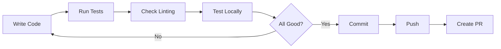

# Development Workflow Guide

This guide covers the day-to-day development workflow for working with the NestJS GraphQL Microservices project.

## Table of Contents

- [Getting Started](#getting-started)
- [Daily Development Flow](#daily-development-flow)
- [Feature Development](#feature-development)
- [Testing Workflow](#testing-workflow)
- [Code Review Process](#code-review-process)
- [Git Workflow](#git-workflow)
- [Development Best Practices](#development-best-practices)
- [Debugging Techniques](#debugging-techniques)
- [Performance Optimization](#performance-optimization)
- [Team Collaboration](#team-collaboration)

## Getting Started

### First Day Setup

```bash
# 1. Clone the repository
git clone https://github.com/your-org/nestjs-graphql-microservices
cd nestjs-graphql-microservices

# 2. Install dependencies
pnpm install

# 3. Setup environment
cp .env.example .env
# Edit .env files for each service

# 4. Initialize the project
pnpm project:init

# 5. Start development
pnpm dev

# 6. Verify everything works
curl http://localhost:3000/graphql
```

### IDE Setup

#### VS Code Extensions

```json
// .vscode/extensions.json
{
  "recommendations": [
    "dbaeumer.vscode-eslint",
    "esbenp.prettier-vscode",
    "prisma.prisma",
    "graphql.vscode-graphql",
    "nrwl.angular-console",
    "firsttris.vscode-jest-runner",
    "ms-vscode.vscode-typescript-tslint-plugin",
    "christian-kohler.path-intellisense",
    "mikestead.dotenv"
  ]
}
```

#### VS Code Settings

```json
// .vscode/settings.json
{
  "editor.formatOnSave": true,
  "editor.codeActionsOnSave": {
    "source.fixAll.eslint": true
  },
  "typescript.tsdk": "node_modules/typescript/lib",
  "typescript.enablePromptUseWorkspaceTsdk": true,
  "files.exclude": {
    "**/.git": true,
    "**/.DS_Store": true,
    "**/node_modules": true,
    "dist": true,
    ".nx": true
  },
  "jest.autoRun": {
    "watch": false,
    "onSave": "test-file"
  }
}
```

## Daily Development Flow

### Morning Routine

```bash
# 1. Update your local main branch
git checkout main
git pull origin main

# 2. Create/checkout your feature branch
git checkout -b feature/your-feature-name

# 3. Ensure dependencies are up to date
pnpm install

# 4. Start all services
pnpm dev  # If types already exist
# OR
pnpm dev:init  # If types need to be generated

# Alternative: Start with watch mode for automatic type regeneration
pnpm dev:watch

# 5. Check for any breaking changes
pnpm test:affected
```

### Development Cycle



### Before Committing

```bash
# 1. Ensure types are up to date (if schema changed)
pnpm codegen

# 2. Format code
pnpm nx format:write

# 3. Run linting
pnpm lint

# 4. Run tests
pnpm test:affected

# 5. Build affected projects (includes automatic codegen)
pnpm nx affected:build

# 6. Run type checking
pnpm nx affected --target=typecheck
```

## Feature Development

### Creating a New Feature

#### 1. Plan the Feature

```markdown
## Feature: User Favorites

### Requirements
- Users can favorite products
- View list of favorited products
- Maximum 100 favorites per user

### Technical Design
- New `Favorite` entity
- Many-to-many relationship
- GraphQL mutations: addFavorite, removeFavorite
- GraphQL query: myFavorites
```

#### 2. Create Feature Branch

```bash
git checkout -b feature/user-favorites
```

#### 3. Database Schema

```prisma
// apps/products-service/prisma/schema.prisma
model Favorite {
  id        String   @id @default(uuid())
  userId    String
  productId String
  product   Product  @relation(fields: [productId], references: [id])
  createdAt DateTime @default(now())
  
  @@unique([userId, productId])
  @@index([userId])
}
```

#### 4. Run Migration

```bash
# Generate migration
cd apps/products-service
npx prisma migrate dev --name add_favorites

# Generate Prisma client
pnpm prisma:generate:products
```

#### 5. Update GraphQL Schema

```typescript
// apps/products-service/src/app/favorites/entities/favorite.entity.ts
@ObjectType()
export class Favorite {
  @Field(() => ID)
  id: string

  @Field()
  userId: string

  @Field()
  productId: string

  @Field(() => Product)
  product?: Product

  @Field()
  createdAt: Date
}
```

#### 6. Implement Service

```typescript
// apps/products-service/src/app/favorites/favorites.service.ts
@Injectable()
export class FavoritesService {
  constructor(private prisma: PrismaService) {}

  async addFavorite(userId: string, productId: string): Promise<Favorite> {
    // Check limit
    const count = await this.prisma.favorite.count({ where: { userId } })
    if (count >= 100) {
      throw new BadRequestException('Maximum favorites limit reached')
    }

    return this.prisma.favorite.create({
      data: { userId, productId },
      include: { product: true }
    })
  }

  async getUserFavorites(userId: string): Promise<Favorite[]> {
    return this.prisma.favorite.findMany({
      where: { userId },
      include: { product: true },
      orderBy: { createdAt: 'desc' }
    })
  }
}
```

#### 7. Create Resolver

```typescript
// apps/products-service/src/app/favorites/favorites.resolver.ts
@Resolver(() => Favorite)
export class FavoritesResolver {
  constructor(private favoritesService: FavoritesService) {}

  @Mutation(() => Favorite)
  async addFavorite(
    @Args('productId') productId: string,
    @CurrentUser() user: User
  ): Promise<Favorite> {
    return this.favoritesService.addFavorite(user.id, productId)
  }

  @Query(() => [Favorite])
  async myFavorites(@CurrentUser() user: User): Promise<Favorite[]> {
    return this.favoritesService.getUserFavorites(user.id)
  }
}
```

#### 8. Write Tests

```typescript
// apps/products-service/src/app/favorites/favorites.service.spec.ts
describe('FavoritesService', () => {
  let service: FavoritesService
  let prisma: MockPrismaService

  beforeEach(async () => {
    const module = await Test.createTestingModule({
      providers: [
        FavoritesService,
        { provide: PrismaService, useValue: mockPrismaService() }
      ]
    }).compile()

    service = module.get(FavoritesService)
    prisma = module.get(PrismaService)
  })

  describe('addFavorite', () => {
    it('should add a favorite', async () => {
      const userId = 'user-123'
      const productId = 'product-456'
      
      prisma.favorite.count.mockResolvedValue(5)
      prisma.favorite.create.mockResolvedValue({
        id: 'fav-1',
        userId,
        productId,
        createdAt: new Date()
      })

      const result = await service.addFavorite(userId, productId)
      
      expect(result.userId).toBe(userId)
      expect(result.productId).toBe(productId)
    })

    it('should throw error when limit exceeded', async () => {
      prisma.favorite.count.mockResolvedValue(100)
      
      await expect(
        service.addFavorite('user-123', 'product-456')
      ).rejects.toThrow('Maximum favorites limit reached')
    })
  })
})
```

#### 9. Update Documentation

```graphql
# libs/codegen/src/operations/favorites.graphql
mutation AddFavorite($productId: String!) {
  addFavorite(productId: $productId) {
    id
    product {
      id
      name
      price
    }
    createdAt
  }
}

query MyFavorites {
  myFavorites {
    id
    product {
      id
      name
      price
      stock
    }
    createdAt
  }
}
```

#### 10. Generate Types

```bash
# Types are automatically generated when using pnpm dev or pnpm build
# But you can also run manually:
pnpm codegen

# Or use watch mode during development
pnpm codegen:watch
```

> **Note**: Since codegen is integrated into the build process via `prebuild` and `predev` scripts, 
> you typically don't need to run it manually. Types will be automatically generated:
> - Before starting development with `pnpm dev`
> - Before building with `pnpm build`
> - Continuously when using `pnpm dev:watch`

## Testing Workflow

### Test Pyramid

```
         /\
        /  \  E2E Tests (Few)
       /    \
      /------\  Integration Tests (Some)
     /        \
    /----------\  Unit Tests (Many)
```

### Running Tests

```bash
# Unit tests for a specific service
nx test users-service

# Integration tests
nx e2e users-service-e2e

# Test with coverage
nx test users-service --coverage

# Test in watch mode
nx test users-service --watch

# Test only affected by changes
nx affected:test
```

### Writing Good Tests

```typescript
describe('UsersService', () => {
  let service: UsersService

  // Group related tests
  describe('findAll', () => {
    it('should return paginated results', async () => {
      // Arrange
      const mockUsers = createMockUsers(5)
      
      // Act
      const result = await service.findAll({ limit: 10, offset: 0 })
      
      // Assert
      expect(result.items).toHaveLength(5)
      expect(result.total).toBe(5)
      expect(result.hasMore).toBe(false)
    })

    it('should apply filters correctly', async () => {
      // Test specific behavior
    })
  })

  // Test error cases
  describe('error handling', () => {
    it('should throw NotFoundException for invalid ID', async () => {
      await expect(service.findOne('invalid-id'))
        .rejects
        .toThrow(NotFoundException)
    })
  })
})
```

### E2E Testing

```typescript
describe('Users API (e2e)', () => {
  let app: INestApplication

  beforeAll(async () => {
    const moduleFixture = await Test.createTestingModule({
      imports: [AppModule],
    }).compile()

    app = moduleFixture.createNestApplication()
    await app.init()
  })

  describe('GraphQL Queries', () => {
    it('should get users', () => {
      return request(app.getHttpServer())
        .post('/graphql')
        .send({
          query: `
            query {
              users {
                id
                name
                email
              }
            }
          `
        })
        .expect(200)
        .expect(res => {
          expect(res.body.data.users).toBeDefined()
          expect(res.body.data.users).toBeInstanceOf(Array)
        })
    })
  })

  afterAll(async () => {
    await app.close()
  })
})
```

## Code Review Process

### Creating a Pull Request

```markdown
## Description
Brief description of what this PR does

## Type of Change
- [ ] Bug fix
- [ ] New feature
- [ ] Breaking change
- [ ] Documentation update

## How Has This Been Tested?
- [ ] Unit tests
- [ ] Integration tests
- [ ] Manual testing

## Checklist
- [ ] My code follows the style guidelines
- [ ] I have performed a self-review
- [ ] I have commented my code where necessary
- [ ] I have made corresponding changes to the documentation
- [ ] My changes generate no new warnings
- [ ] I have added tests that prove my fix/feature works
- [ ] New and existing unit tests pass locally
- [ ] Any dependent changes have been merged
```

### Code Review Checklist

For reviewers:

- [ ] **Logic**: Is the logic correct and efficient?
- [ ] **Tests**: Are there adequate tests?
- [ ] **Security**: Any security concerns?
- [ ] **Performance**: Any performance issues?
- [ ] **Standards**: Does it follow our standards?
- [ ] **Documentation**: Is it properly documented?
- [ ] **Types**: Are TypeScript types correct?
- [ ] **Error Handling**: Are errors handled properly?

### Handling Feedback

```bash
# Make requested changes
git add .
git commit -m "fix: address PR feedback"

# Or amend if small changes
git add .
git commit --amend --no-edit

# Force push to your branch
git push --force-with-lease origin feature/your-feature
```

## Git Workflow

### Branch Naming

```
feature/user-authentication
bugfix/login-error-handling
hotfix/security-patch
chore/update-dependencies
docs/api-documentation
```

### Commit Messages

Follow conventional commits:

```
feat: add user favorites feature
fix: resolve race condition in auth service
docs: update API documentation
style: format code with prettier
refactor: extract validation logic
test: add tests for favorites service
chore: update dependencies
perf: optimize database queries
```

### Git Flow

```bash
# 1. Create feature branch
git checkout -b feature/new-feature

# 2. Make changes and commit
git add .
git commit -m "feat: add new feature"

# 3. Keep branch updated
git fetch origin
git rebase origin/main

# 4. Push branch
git push origin feature/new-feature

# 5. Create PR and merge

# 6. Clean up
git checkout main
git pull origin main
git branch -d feature/new-feature
```

### Handling Conflicts

```bash
# 1. Update main
git checkout main
git pull origin main

# 2. Rebase your branch
git checkout feature/your-feature
git rebase main

# 3. Resolve conflicts
# Edit conflicted files
git add .
git rebase --continue

# 4. Force push
git push --force-with-lease origin feature/your-feature
```

## Development Best Practices

### Code Organization

```typescript
// Good: Single responsibility
@Injectable()
export class UserValidationService {
  validateEmail(email: string): boolean { }
  validatePassword(password: string): boolean { }
}

// Bad: Too many responsibilities
@Injectable()
export class UserService {
  validateEmail() { }
  sendEmail() { }
  hashPassword() { }
  createUser() { }
  updateProfile() { }
}
```

### Error Handling

```typescript
// Good: Specific error handling
try {
  const user = await this.usersService.findOne(id)
  if (!user) {
    throw new NotFoundException(`User with ID ${id} not found`)
  }
  return user
} catch (error) {
  if (error instanceof NotFoundException) {
    throw error
  }
  this.logger.error('Unexpected error finding user', error)
  throw new InternalServerErrorException('Failed to fetch user')
}

// Bad: Generic error handling
try {
  return await this.usersService.findOne(id)
} catch (error) {
  throw new Error('Something went wrong')
}
```

### Performance Considerations

```typescript
// Good: Batch operations
const userIds = products.map(p => p.userId)
const users = await this.usersService.findByIds(userIds)
const userMap = new Map(users.map(u => [u.id, u]))

// Bad: N+1 queries
for (const product of products) {
  const user = await this.usersService.findOne(product.userId)
  product.user = user
}
```

## Debugging Techniques

### Using VS Code Debugger

```json
// .vscode/launch.json
{
  "version": "0.2.0",
  "configurations": [
    {
      "type": "node",
      "request": "launch",
      "name": "Debug Users Service",
      "runtimeExecutable": "pnpm",
      "runtimeArgs": ["nx", "serve", "users-service"],
      "console": "integratedTerminal",
      "internalConsoleOptions": "neverOpen"
    }
  ]
}
```

### Logging Strategy

```typescript
@Injectable()
export class LoggerService {
  private logger = new Logger()

  logRequest(method: string, args: any) {
    this.logger.log(`${method} called with args: ${JSON.stringify(args)}`)
  }

  logError(method: string, error: Error) {
    this.logger.error(`${method} failed: ${error.message}`, error.stack)
  }

  logPerformance(method: string, duration: number) {
    if (duration > 1000) {
      this.logger.warn(`${method} took ${duration}ms`)
    }
  }
}

// Usage
@Injectable()
export class UsersService {
  async findOne(id: string) {
    const start = Date.now()
    this.logger.logRequest('findOne', { id })
    
    try {
      const user = await this.prisma.user.findUnique({ where: { id } })
      return user
    } catch (error) {
      this.logger.logError('findOne', error)
      throw error
    } finally {
      this.logger.logPerformance('findOne', Date.now() - start)
    }
  }
}
```

### GraphQL Query Debugging

```typescript
// Enable GraphQL playground query tracing
GraphQLModule.forRoot({
  playground: {
    settings: {
      'request.credentials': 'include',
      'tracing.hideTracingResponse': false
    }
  },
  debug: true,
  tracing: true
})
```

## Performance Optimization

### Query Optimization

```typescript
// Use field selection
async findAll(fields?: string[]) {
  return this.prisma.user.findMany({
    select: fields ? 
      Object.fromEntries(fields.map(f => [f, true])) : 
      undefined
  })
}

// Use pagination
async findPaginated(page: number, limit: number) {
  const [items, total] = await Promise.all([
    this.prisma.user.findMany({
      skip: (page - 1) * limit,
      take: limit
    }),
    this.prisma.user.count()
  ])

  return {
    items,
    total,
    page,
    totalPages: Math.ceil(total / limit)
  }
}
```

### Caching Strategy

```typescript
@Injectable()
export class CacheService {
  private cache = new Map<string, CacheEntry>()

  async get<T>(key: string, factory: () => Promise<T>, ttl = 300000): Promise<T> {
    const cached = this.cache.get(key)
    
    if (cached && cached.expiresAt > Date.now()) {
      return cached.value as T
    }

    const value = await factory()
    this.cache.set(key, {
      value,
      expiresAt: Date.now() + ttl
    })

    return value
  }

  invalidate(pattern: string) {
    for (const key of this.cache.keys()) {
      if (key.includes(pattern)) {
        this.cache.delete(key)
      }
    }
  }
}
```

## Team Collaboration

### Daily Standup Template

```markdown
## Yesterday
- Completed user authentication feature
- Fixed bug in product search

## Today
- Working on favorites feature
- Code review for PR #123

## Blockers
- Need clarification on caching strategy
- Waiting for design approval
```

### Documentation Standards

```typescript
/**
 * Finds a user by their email address
 * @param email - The email address to search for
 * @returns The user if found, null otherwise
 * @throws {ValidationException} If email format is invalid
 * @example
 * const user = await usersService.findByEmail('user@example.com')
 */
async findByEmail(email: string): Promise<User | null> {
  if (!isValidEmail(email)) {
    throw new ValidationException('Invalid email format')
  }
  
  return this.prisma.user.findUnique({
    where: { email: email.toLowerCase() }
  })
}
```

### Knowledge Sharing

- **Tech Talks**: Weekly 30-minute sessions
- **Pair Programming**: For complex features
- **Code Reviews**: Learn from each other
- **Documentation**: Keep it updated
- **Retrospectives**: Continuous improvement

## Productivity Tips

### Keyboard Shortcuts

```
# VS Code
Cmd/Ctrl + P         - Quick file open
Cmd/Ctrl + Shift + P - Command palette
Cmd/Ctrl + .         - Quick fix
F12                  - Go to definition
Shift + F12          - Find all references
```

### Terminal Aliases

```bash
# Add to ~/.zshrc or ~/.bashrc
alias dev="pnpm dev"
alias test="pnpm test"
alias build="pnpm build"
alias gen="pnpm codegen"
alias migrate="pnpm prisma:migrate:users && pnpm prisma:migrate:products"
```

### Snippets

```json
// VS Code snippets for GraphQL
{
  "GraphQL Resolver": {
    "prefix": "resolver",
    "body": [
      "@Resolver(() => ${1:Entity})",
      "export class ${1:Entity}Resolver {",
      "  constructor(private readonly ${2:service}: ${1:Entity}Service) {}",
      "",
      "  @Query(() => [${1:Entity}])",
      "  async ${3:findAll}(): Promise<${1:Entity}[]> {",
      "    return this.${2:service}.${3:findAll}()",
      "  }",
      "}"
    ]
  }
}
```

## Continuous Learning

- **Code Reviews**: Learn from others
- **Documentation**: Read and contribute
- **Experiments**: Try new approaches
- **Conferences**: Stay updated
- **Open Source**: Contribute back

Remember: Good development workflow is about consistency, communication, and continuous improvement.