# Architecture Overview

## Table of Contents

- [System Architecture](#system-architecture)
- [Request Flow](#request-flow)
- [Federation Architecture](#federation-architecture)
- [Database Schema](#database-schema)
- [Deployment Architecture](#deployment-architecture)
- [Development Workflow](#development-workflow)
- [CI/CD Pipeline](#cicd-pipeline)
- [Service Communication Patterns](#service-communication-patterns)
- [Security Architecture](#security-architecture)
- [Monitoring Architecture](#monitoring-architecture)
- [Data Flow Architecture](#data-flow-architecture)
- [Scaling Strategy](#scaling-strategy)
- [Rendering Diagrams](#rendering-diagrams)

This document contains comprehensive architecture diagrams for the NestJS GraphQL Microservices project.

## System Architecture

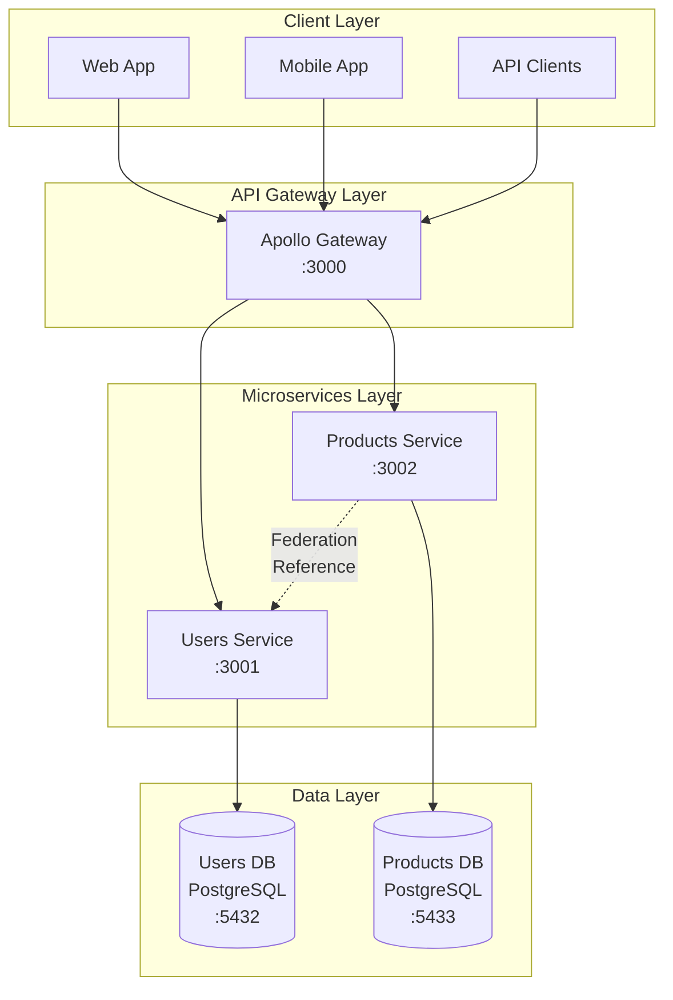

## Request Flow

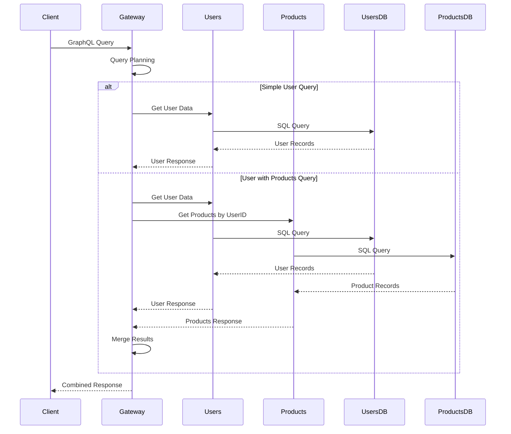

## Federation Architecture

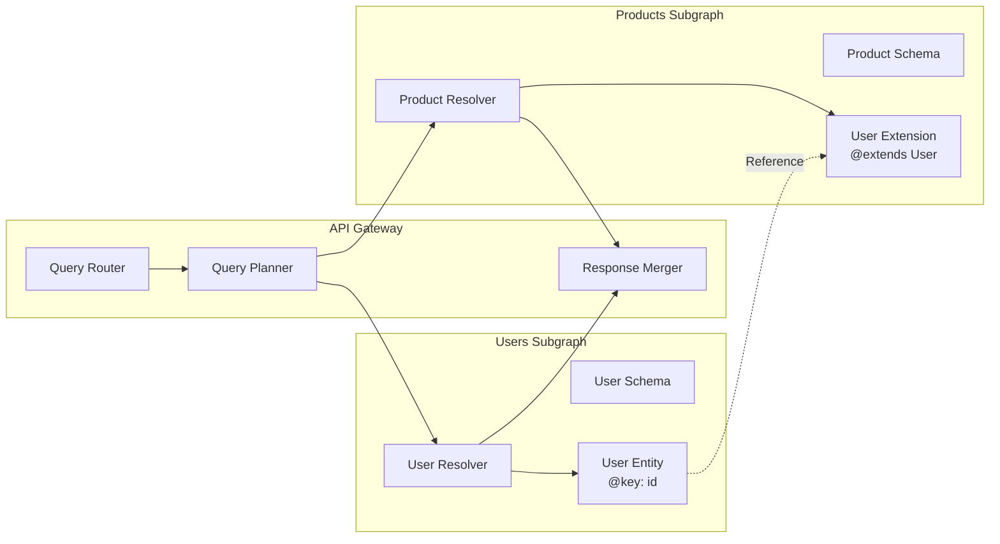

## Database Schema

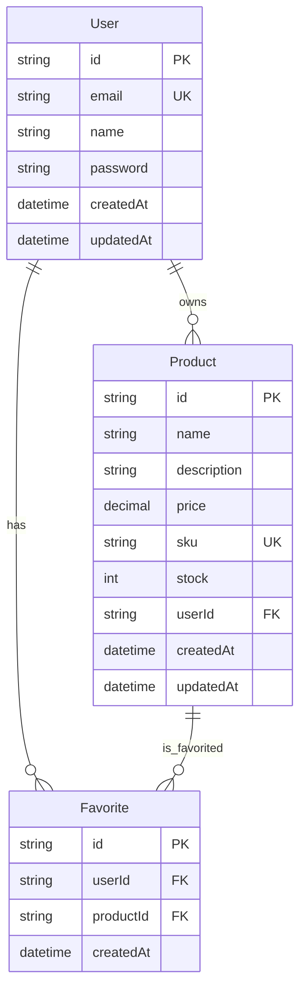

## Deployment Architecture

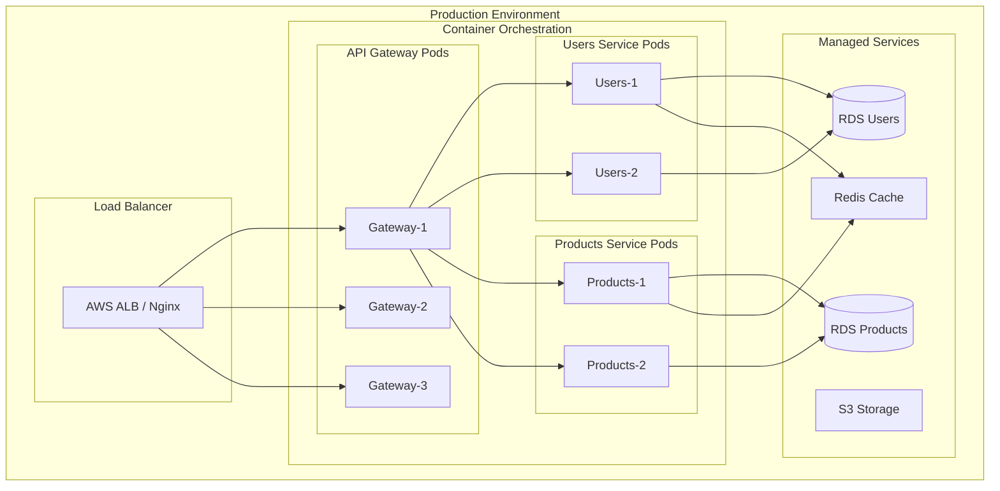

## Development Workflow

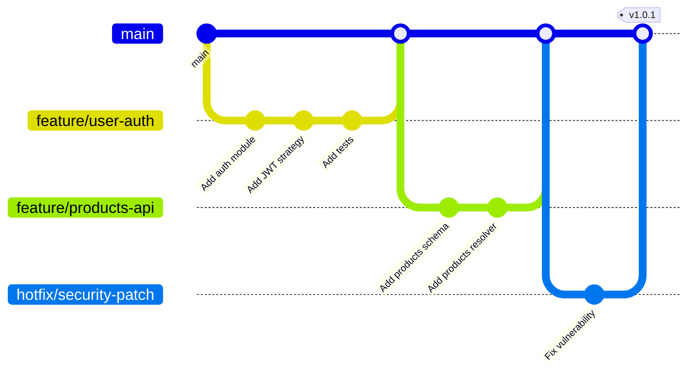

## CI/CD Pipeline

```mermaid
graph LR
    subgraph "Source Control"
        Git[GitHub/GitLab]
    end
    
    subgraph "CI Pipeline"
        Test[Run Tests]
        Lint[Lint Code]
        Build[Build Images]
        Scan[Security Scan]
    end
    
    subgraph "Registry"
        ECR[Container Registry]
    end
    
    subgraph "CD Pipeline"
        Deploy[Deploy to K8s]
        Migrate[Run Migrations]
        Health[Health Checks]
    end
    
    subgraph "Environments"
        Dev[Development]
        Staging[Staging]
        Prod[Production]
    end
    
    Git --> Test
    Test --> Lint
    Lint --> Build
    Build --> Scan
    Scan --> ECR
    ECR --> Deploy
    Deploy --> Migrate
    Migrate --> Health
    Health --> Dev
    Dev --> Staging
    Staging --> Prod
```

## Service Communication Patterns

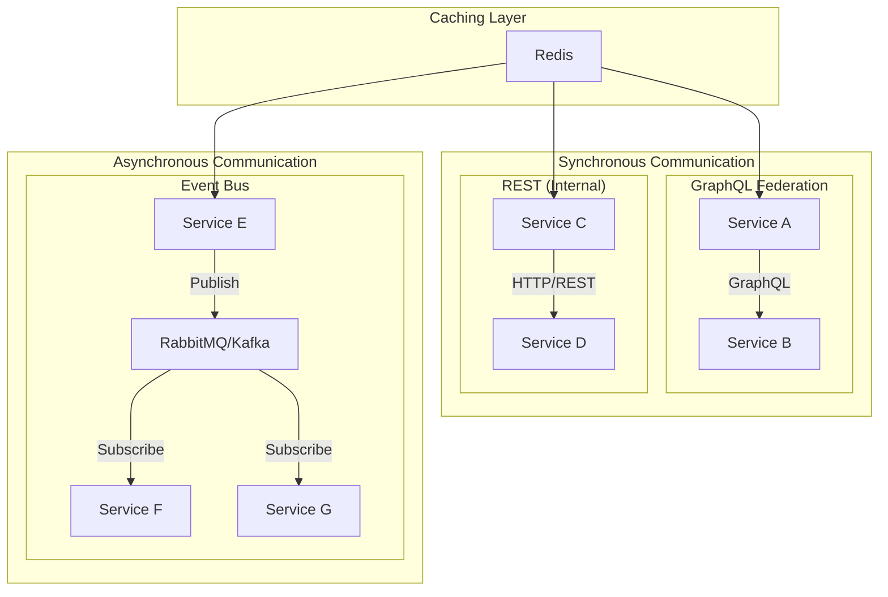

## Security Architecture

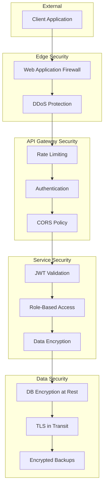

## Monitoring Architecture

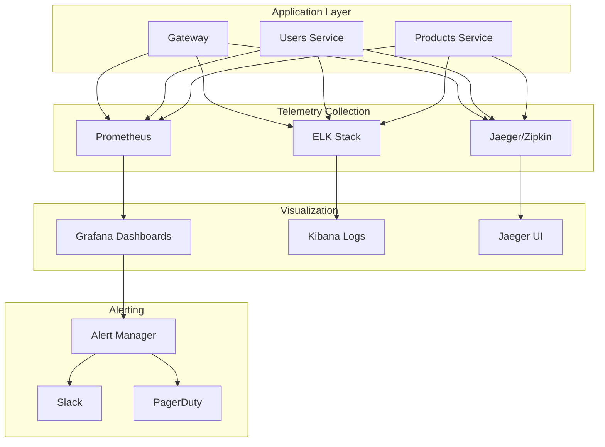

## Data Flow Architecture

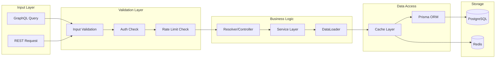

## Scaling Strategy

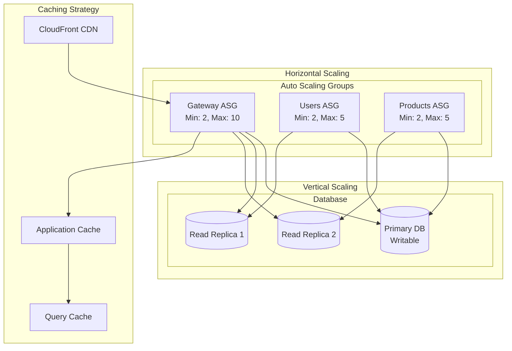

## Rendering Diagrams

These diagrams use Mermaid syntax and can be rendered in:
- GitHub/GitLab (automatic rendering)
- VS Code with Mermaid plugin
- Online at [mermaid.live](https://mermaid.live)
- Documentation sites like Docusaurus

To export as images:
1. Copy the Mermaid code
2. Paste into [mermaid.live](https://mermaid.live)
3. Export as PNG/SVG
4. Save to this folder